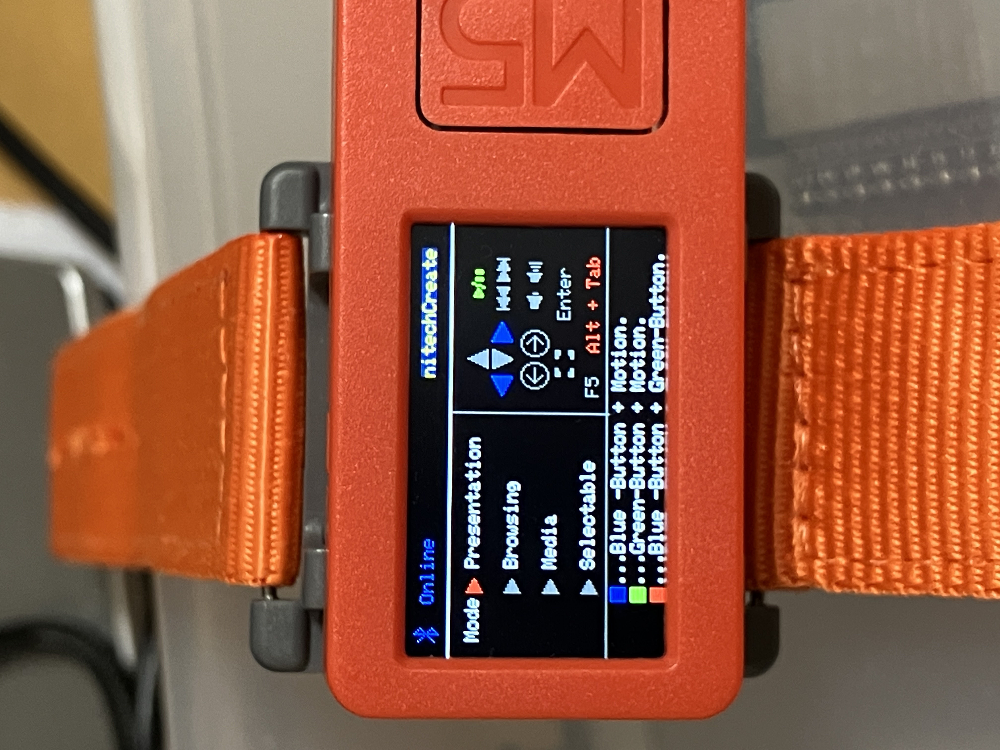

# Body Interface

2023年4月から取り組んでいるプロジェクトです。
"全身デバイス"を実現するため段階的に様々な機能をタ名しています。

## 1.手でスライド送り

初めに作成しようとしたのが、"指パッチンでスライドを送る"デバイスです。 指っパッチンをトリガーにするため、勢いでボタン押下、*パッチン*の音、などを考えましたが、指パッチンのメカニズムを調べてみると、指先や手の腹にモノを入れてしまうとうまく音が出ないとのことでした。よってパッチンではなく、ジェスチャーをトリガーにしようと考えました。 ジェスチャーでやるにしても、手段はいくつかあります。まず思いつくのは「モーキャプ」でしょう。しかし私が目指す（好きな）のはウェアラブル。 よってとりあえず「**加速度センサ**」を使うことにしました。 では次、いかにしてスライドを送りましょう。単純ですが、思いつくのは「キーボード」でした。調べてみると、[ESP32 BLE keyboard.h]なるライブラリがあるではありませんか。よって使うマイコンはESP32です。,, **ESP32でIMUを使いウェアラブルにしたい。** このすべてを解決してくれるものがありました。(持っていた) **M5Stick C Plus**です。 そこで数日掛けカタカタ打ちまくった結果.....  できました。   
少し見栄えは悪いですが、初号機、プロトタイプとしては十分でしょう。 
> - 機能 
>
> ボタンを押している間に手を振ると ←/→ のキーコードを送信する。

で、これにショートカットキーなどいろいろ追加してUIとかもいろいろやったのがこれ

## 2.手でマウス操作

BLE keyboard.h なるライブラリの作者が BLE mouse.h なるライブラリをも作っていたので次はマウス。(もう一つ有能ライブラリあります。後に続く) 1で作った方は、ジェスチャーなのでなんとなくで動き判定を行っていましたが、さすがにマウスとなると、x軸方向y軸方向のカーソル移動を分ける必要があるのでもう少し厳密に加速度センサを扱わなければなりませんね。
そこで観察してみました。 

航空学科じゃないので詳しくなかったのですが、色々調べながらやったところ

P,R,Yはピッチ,ロール,ヨー gX,gY,gZは軸の角速度   と分かった。これらを組み込んでやったのが......

    こちら。

